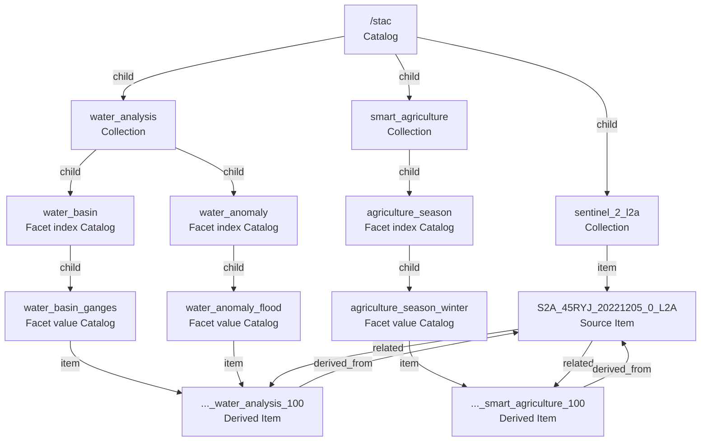

# DaFab STAC structure

## Purpose

This document describes the STAC structure defined for DaFab D3.2 and exposed by
the public DaFab service at <https://dafab.cern.ch/stac>.

DaFab presents Rucio-backed metadata as standard STAC Catalog, Collection, and
Item documents. URL paths make the resources easy to inspect. Clients should
still navigate through `links` because the STAC link graph is the public
contract.

## Navigation model

The D3.2 target graph has three levels of navigation.

1. The root Catalog links to product Collections.
2. Derived-product Collections link to facet Catalogs.
3. Collections and facet Catalogs link to Items.



The same Item can be advertised by several facet value Catalogs. This is an
indexing relationship and does not create several canonical Item parents.

## Public resources

### Root and Collections

| Kind | ID | URL |
|---|---|---|
| Root Catalog | `stac` | <https://dafab.cern.ch/stac> |
| Collection | `sentinel_2_l2a` | <https://dafab.cern.ch/stac/collections/sentinel_2_l2a> |
| Collection | `water_analysis` | <https://dafab.cern.ch/stac/collections/water_analysis> |
| Collection | `smart_agriculture` | <https://dafab.cern.ch/stac/collections/smart_agriculture> |

### Facet Catalogs

| Kind | ID | URL |
|---|---|---|
| Facet index | `water_anomaly` | <https://dafab.cern.ch/stac/collections/water_analysis/catalogs/water_anomaly> |
| Facet value | `water_anomaly_flood` | <https://dafab.cern.ch/stac/collections/water_analysis/catalogs/water_anomaly/water_anomaly_flood> |
| Facet value | `water_anomaly_drought` | <https://dafab.cern.ch/stac/collections/water_analysis/catalogs/water_anomaly/water_anomaly_drought> |
| Facet value | `water_anomaly_normal` | <https://dafab.cern.ch/stac/collections/water_analysis/catalogs/water_anomaly/water_anomaly_normal> |
| Facet index | `water_basin` | <https://dafab.cern.ch/stac/collections/water_analysis/catalogs/water_basin> |
| Facet value | `water_basin_ganges` | <https://dafab.cern.ch/stac/collections/water_analysis/catalogs/water_basin/water_basin_ganges> |
| Facet index | `agriculture_season` | <https://dafab.cern.ch/stac/collections/smart_agriculture/catalogs/agriculture_season> |
| Facet value | `agriculture_season_winter` | <https://dafab.cern.ch/stac/collections/smart_agriculture/catalogs/agriculture_season/agriculture_season_winter> |
| Facet value | `agriculture_season_spring` | <https://dafab.cern.ch/stac/collections/smart_agriculture/catalogs/agriculture_season/agriculture_season_spring> |
| Facet value | `agriculture_season_summer` | <https://dafab.cern.ch/stac/collections/smart_agriculture/catalogs/agriculture_season/agriculture_season_summer> |
| Facet value | `agriculture_season_autumn` | <https://dafab.cern.ch/stac/collections/smart_agriculture/catalogs/agriculture_season/agriculture_season_autumn> |

### Representative Items

| Kind | ID | URL |
|---|---|---|
| Source Item | `S2A_45RYJ_20221205_0_L2A` | <https://dafab.cern.ch/stac/collections/sentinel_2_l2a/items/S2A_45RYJ_20221205_0_L2A> |
| Water-analysis Item | `S2A_45RYJ_20221205_0_L2A_water_analysis_100` | <https://dafab.cern.ch/stac/collections/water_analysis/items/S2A_45RYJ_20221205_0_L2A_water_analysis_100> |
| Smart-agriculture Item | `S2A_30TYN_20200311_1_L2A_smart_agriculture_120` | <https://dafab.cern.ch/stac/collections/smart_agriculture/items/S2A_30TYN_20200311_1_L2A_smart_agriculture_120> |

## Object profiles

### Catalogs

The root, facet index, and facet value nodes are standard STAC Catalog objects.
They use the core fields `type`, `stac_version`, `id`, `description`, and
`links`.

The root uses `child` links for Collections. A facet index uses `child` links
for its values. A facet value uses `item` links for matching Items. Empty facet
value Catalogs are valid and can advertise a supported value before matching
Items exist.

### Collections

Each Collection contains the required STAC Collection fields including
`license`, `extent`, and `links`.

The `sentinel_2_l2a` Collection advertises source Items. Derived-product
Collections advertise their facet Catalogs. This separates canonical product
membership from application-specific navigation views.

### Items

Items are STAC GeoJSON Features with `geometry`, `bbox`, `properties`, `links`,
`assets`, and `collection`.

Source Items use the `sentinel_2_l2a` Collection and can expose `related` links
to derived products. Derived Items use `derived_from` links to their source
Items. They can declare the Processing extension and retain product-specific
properties under `dafab:*` namespaces.

Assets remain ordinary STAC Asset objects. Their HREFs point to the product
files represented and managed by Rucio.

## Rucio representation

| STAC concept | Rucio representation | Role |
|---|---|---|
| Root Catalog | Container or generated service document | STAC entry point |
| Collection | Container DID | Product grouping and Collection metadata |
| Facet Catalog | Generated view or container DID | Metadata-driven navigation index |
| Item | Dataset DID | Complete STAC Item metadata |
| Asset | File DID and replicas | Product bytes and storage locations |

The default publication scope is `dafab`. Dataset names follow STAC Item IDs.
Derived Item IDs follow the source Item ID, derived Collection ID, and algorithm
version.

```text
{source_item_id}_{derived_collection_id}_{algorithm_version}
```

PySTAC reads the STAC representation exposed by the service. Rucio operations
such as DID creation, attachment, replica management, and metadata mutation
remain the responsibility of DaFab service and Rucio workflows.

## Facet directionality

Facet membership is intentionally represented from Catalog to Item with
`rel="item"`. A derived Item may belong to several navigation facets such as a
basin and an anomaly class. Adding a `parent` or `collection` backlink for every
facet would make those indexing views appear to be several canonical parents or
Collections for one Item. That would misuse STAC hierarchy semantics.

Reverse membership is therefore obtained by traversing or querying the Catalog
tree and matching its `item` links. The notebook demonstrates this operation.
